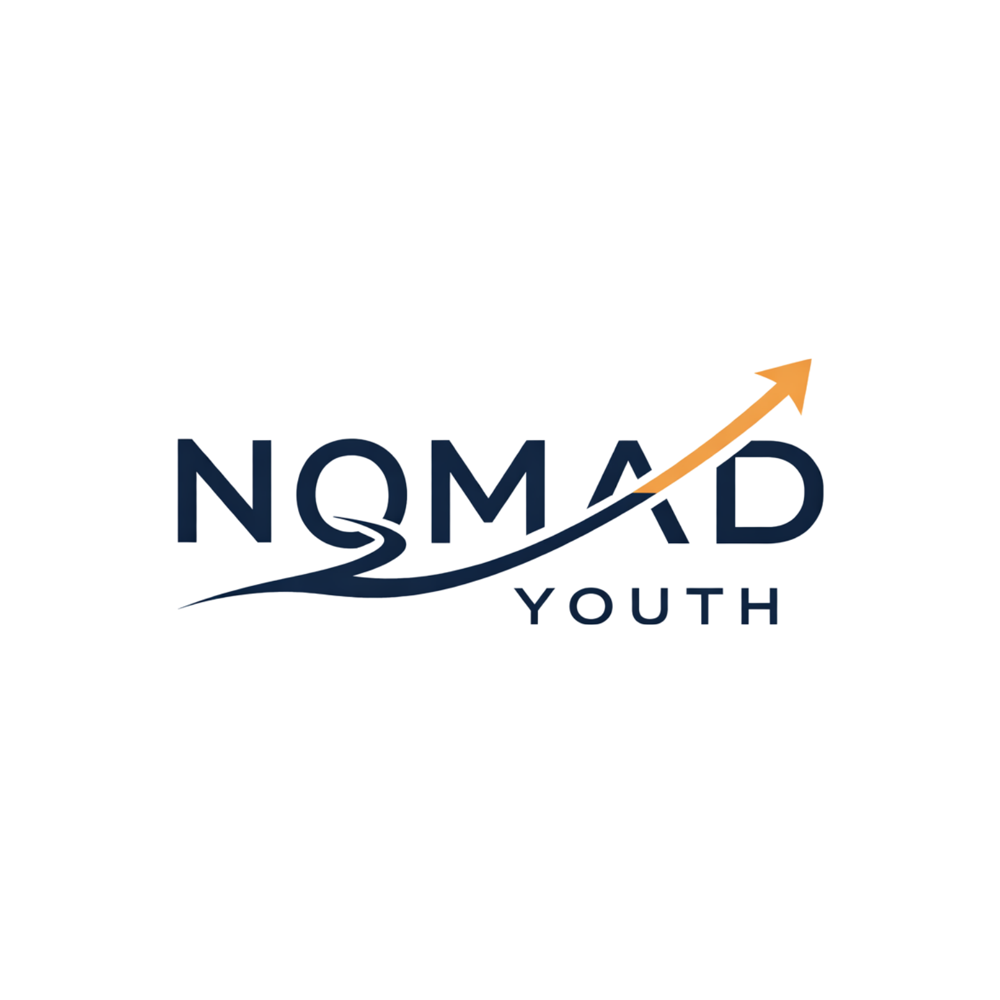
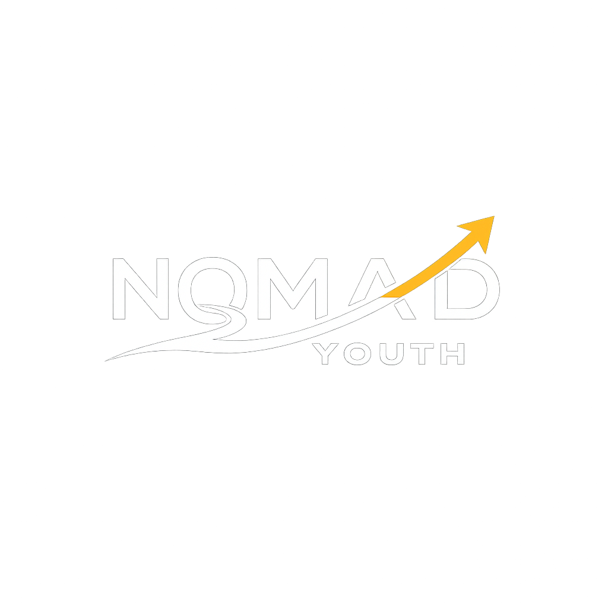

# 🌍 Nomad Youth Platform

**Nomad Youth** is a web platform that helps young people discover opportunities such as scholarships, internships, volunteering programs, competitions, trainings, and events from around the world.

The platform aims to make international and local youth opportunities more accessible through a modern, user-friendly interface.

## ✨ Features

- 🔍 Search and filter opportunities
- ❤️ Save favorite opportunities
- 👍 Like opportunities
- 👤 User authentication (Email & Google OAuth)
- 📋 Personal dashboard
- 📌 Saved opportunities
- 📨 Apply through external links
- 🌐 Multilingual support (Azerbaijani, English, Russian)
- 📱 Responsive design
- 📅 Deadline tracking
- 📩 Contact form

## 🛠️ Tech Stack

### Frontend
- React
- Vite
- React Router
- Axios
- CSS3
- React Icons

### Backend
- Spring Boot
- Spring Security
- JWT Authentication
- Google OAuth 2.0
- JPA / Hibernate
- PostgreSQL

### Deployment
- Frontend: Vercel
- Backend: Render

---

## 📂 Project Structure

```
src/
│
├── assets/
├── components/
├── contexts/
├── hooks/
├── layouts/
├── pages/
├── services/
├── translations/
├── utils/
└── App.jsx
```

---


## 🌐 Available Languages

- 🇦🇿 Azerbaijani
- 🇬🇧 English
- 🇷🇺 Russian

---


## 🔐 Authentication

Users can sign in using:

- Email & Password
- Google OAuth

JWT tokens are used for secure authentication.

---

## 🎯 Future Improvements

- AI-powered opportunity recommendations
- Email notifications
- Admin dashboard
- Opportunity submission portal
- Mobile application


---

## 👥 Team

Developed by the **Nomad Youth Team**.

Special thanks to everyone who contributed to the project.

---

## 📄 License

This project is intended for educational and non-commercial purposes.


<p align="center">
  
  
   
</p>

<h1 align="center">Nomad Youth Platform</h1>

<p align="center">
Connecting young people with opportunities across the world 🌍
</p>

<p align="center">
  <a href="https://nomadyouth.az">🌐 Website</a> •
  <a href="https://nomad-youth-platform.vercel.app">🚀 Demo</a>
</p>

<p align="center">
  
  
  
  
  
</p>
